# 🧪 Laboratoire 01 — Installation et création de la base de données


<div class="bg-blue-50 border border-blue-200 text-blue-900 rounded-lg p-4">
<strong>Dans ce laboratoire, vous allez :</strong><br>

1) Installer la base de données PostgreSQL
2) Installer le client DBeaver
3) Créer une nouvelle connexion PostgreSQL
4) Créer une nouvelle base de données
</div>

## Prérequis

<div class="bg-yellow-50 border border-yellow-200 text-yellow-900 rounded-lg p-4">

- Windows (instructions testées sur Windows 11)
- Accès administrateur pour installer des programmes

</div>

## 1. Installer PostgreSQL

1. Téléchargement
	- Rendez-vous sur https://www.postgresql.org/download/windows/ et téléchargez l'installateur
    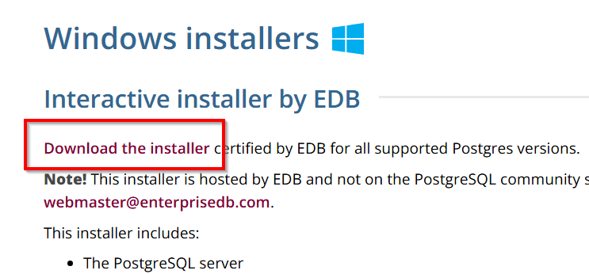

2. Installation via l'installateur
	- Lancez le fichier `.exe` téléchargé et suivez l'assistant.
	- Composants : laissez `PostgreSQL Server` (optionnel : `Command Line Tools`).
        - 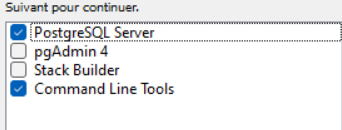
	- Port : `5432` (par défaut).
	- Mot de passe : choisissez un mot de passe pour l'utilisateur `postgres` (superutilisateur).
	- Répertoire des données / Locale : valeurs par défaut.

3. Vérifier le service PostgreSQL
    - Appuyer sur la touche `Win + R`
    - Entrer `services.msc`
    - Trouver `postgresql-x64`
        - 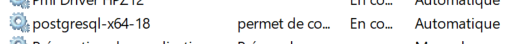
        - Normalement, le service devrait être lancé et avoir un type de démarrage automatique.
        - Dans le cas contraire, vous pouvez le corriger via clic-droit et propriétés.

4. Vérifier que `psql` est accessible dans le PATH

Dans certaines situations, vous utiliserez <strong>psql</strong> en ligne de commande.  
Il doit donc être accessible via le <strong>PATH de Windows</strong>.

1) Ouvrez <strong>Invite de commandes</strong> ou <strong>PowerShell</strong>  
2) Entrez la commande suivante :

```bash
psql --version
```

- Si une version de PostgreSQL s’affiche, tout est correct.
- Si la commande est introuvable, psql n’est pas dans le PATH.

<details id="ajouter-au-path" class="border border-gray-300 rounded-md p-4 my-4 bg-yellow-50 text-gray-800">
  <summary class="cursor-pointer font-semibold">
    Ajouter psql au PATH (si nécessaire)
  </summary>

  <div class="mt-4 space-y-3">

- Appuyer sur WIN / START  
- Taper envi et cliquer sur <code>Modifier les variables d’environnement système</code>  
- Cliquer sur <strong>Variables d’environnement</strong>  
- Dans <strong>Variables système</strong>, sélectionner <code>Path</code>  
- Cliquer sur <strong>Nouveau</strong>  
- Ajouter le dossier où est installé psql  

Emplacement habituel :

```bash
C:\Program Files\PostgreSQL\18\bin
```

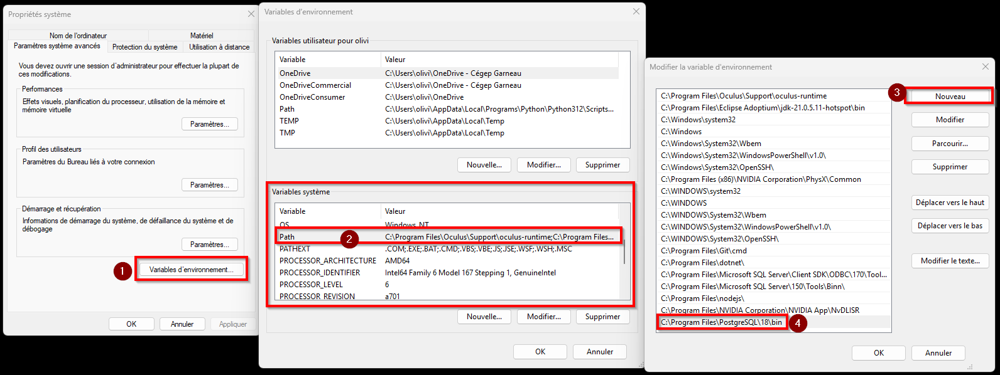

>L'image est petite? Faites un clic-droit et `Ouvrir l'image dans un nouvel onglet`

  </div>
</details>

## 2. Installer DBeaver

DBeaver est un logiciel de gestion de base de données. Il servira à créer et à gérer votre base de données PostgreSQL.

1. Téléchargement
	- Rendez-vous sur https://dbeaver.io/download/ et téléchargez l'installateur
    - 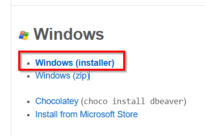

2. Installation via l'installateur
	- Lancez le fichier `.exe` téléchargé et suivez l'assistant.
	- Conservez les paramètres par défaut.

## 3. Créer une nouvelle connexion

À cette étape, vous allez connecter **DBeaver** à votre service **PostgreSQL**.

1) Ouvrir DBeaver.

2) En haut à gauche, cliquer sur `nouvelle connexion`.
    - 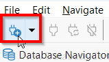

3) Sélectionner la base de données PostgreSQL.
    - 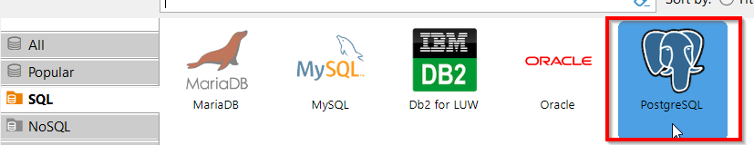

4) Confirmer les options de connexion.
    - Entrez le mot de passe que vous avez sélectionné pour votre compte administrateur lors de l'installation de PostgreSQL.
    - Cocher l'option pour afficher toutes les bases de données.
    - 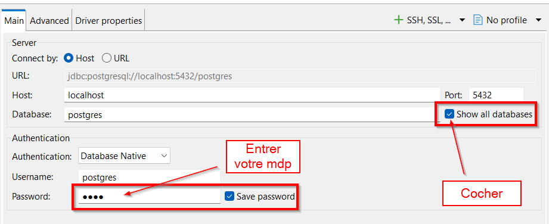

5) Installer les pilotes.
    - Après avoir créé la nouvelle connexion, DBeaver vous proposera de télécharger les pilotes pour PostgreSQL.
    - Cliquer sur télécharger.
    - 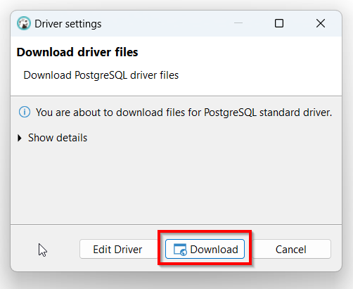

## 4. Créer une base de données

1) La section de gauche de l'interface de DBeaver correspond au navigateur de connexions et de bases de données. Vous devriez voir apparaître votre connexion à PostgreSQL que vous venez de créer.
    - 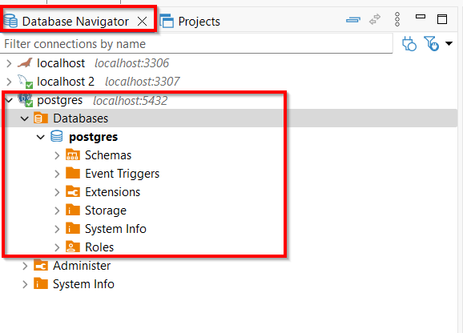

2) Clic-droit sur `Bases de données` et cliquer sur `Créer base de données`
    - 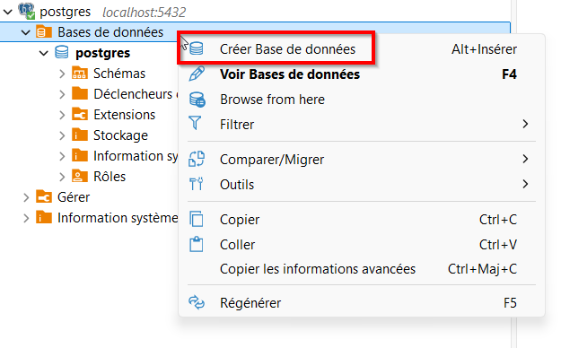

3) Nommer la base de données `lab01` et conserver l'interclassement `UTF8`
    - 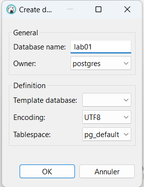

4) Voilà, vous avez maintenant créé votre première base de données. Vous pouvez la conserver ou la supprimer avec clic-droit + supprimer (attention cette action est irréversible --> à ne pas faire pendant vos tps.)
    - 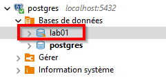

### 4.1 Création de la base de données par code SQL
<div class="bg-green-50 border-green-500 p-4 mt-4 rounded-s text-green-800">

Cette étape vous montre comment créer exactement la même base de données mais **avec une commande SQL**, au lieu d’utiliser l’interface de DBeaver.
Nous verrons cela plus en détail dans le module 2.

1) Vous devez d'abord ouvrir un **nouveau script SQL** avec comme portée toutes les bases de données (voir l'image ci-dessous):
  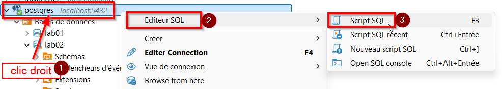

1) Vous pouvez exécuter cette commande dans l’éditeur SQL de DBeaver.

    <div class="bg-gray-50 border-l-4 border-blue-500 p-4 rounded-s">
    <b>Commande SQL :</b>

    ```sql
    create database lab01;
    ```
    </div>

    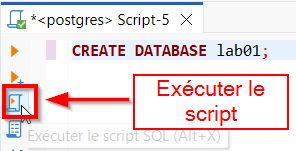

2) Pour voir votre **nouvelle base de données apparaître**, vous devez rafraîchir dans l'explorateur à gauche:
   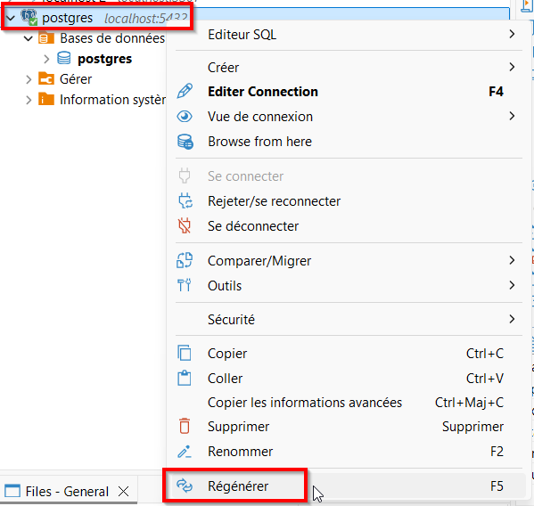
   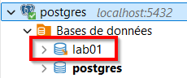

</div>
