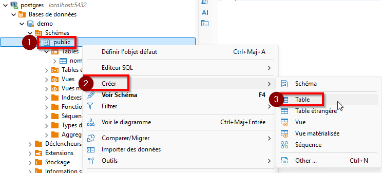
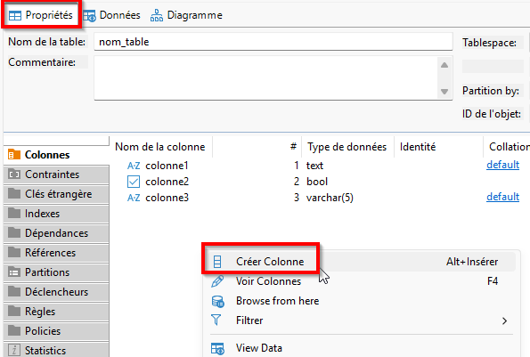

# 02 — Créer une table

## Objectif
Comprendre comment définir la **structure d’une table** à l’aide du DDL, en choisissant des **colonnes**, des **types de données** appropriés et une **organisation cohérente**, avant toute insertion de données.

---

## Qu’est-ce qu’une table (rappel)

Une table représente un **ensemble structuré d’informations** liées à un même concept (entité).

- une table correspond généralement à un **élément du domaine** (ex. événement, client, produit)
- chaque table contient :
  - des **colonnes** (attributs)
  - des **lignes** (enregistrements, sera vu plus tard)

---

## Nommer une table

### Bonnes pratiques
- minuscules
- sans accents
- nom au singulier
- mots séparés par des underscores (`_`)
- nom représentatif du concept

### Exemples acceptables
- `evenement`
- `participant`
- `inscription_evenement`

### Exemples à éviter
- `Événements`
- `Table1`
- `gestionEvenement`
- `evenement-2025`

---

## Définir les colonnes d’une table

Une colonne est définie par :
- un **nom**
- un **type de données**
- éventuellement des **contraintes** (abordées plus tard)

### Exemple de colonnes
| Colonne | Description |
|------|------------|
| `id` | Identifiant de l’élément |
| `nom` | Nom de l’élément |
| `date_creation` | Date de création |
| `actif` | État logique |

---

## Types de données courants (PostgreSQL)

### Types numériques
- `INTEGER` (ex. : âge, quantité, nombre de places)
- `SERIAL` *(aperçu, utilisé plus tard pour les clés primaires)* (ex. : identifiant automatique)

### Types textuels
- `VARCHAR(n)` (ex. : `VARCHAR(100)` pour un nom ou un courriel)
- `TEXT` (ex. : description, commentaire long)

### Dates et temps
- `DATE` (ex. : date de naissance, date d’événement)
- `TIMESTAMP` (ex. : date et heure d’inscription)

### Autres types utiles
- `BOOLEAN` (ex. : actif / inactif)
- `NUMERIC(p, s)` (ex. : `NUMERIC(8,2)` pour un montant en dollars)

**Choisir un type approprié est essentiel** pour la cohérence et la qualité des données.

---

## Instruction `CREATE TABLE`

### Syntaxe générale
```sql
create table nom_table (
  colonne1 type_donnees,
  colonne2 type_donnees,
  colonne3 type_donnees
);
```

### Option GUI

<details id="ajouter-au-path" class="border border-gray-300 rounded-md p-4 my-4 bg-yellow-50 text-gray-800">
  <summary class="cursor-pointer font-semibold">
    À titre indicatif seulement (ne pas utiliser cette approche pour les travaux à remettre)
  </summary>

- Pour créer une table avec le GUI, vous devez sélectionner le schéma dans lequel vous voulez la créer. Dans ce cours, sélectionnez toujours le schéma `public` de votre base de données.



- Vous pouvez ensuite ajouter des colonnes en allant dans les `propriétés`, clic-droit dans l'espace blanc et `Créer Colonne`



</details>