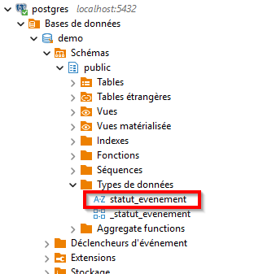

# 03 — Contraintes et Enums

## Objectif
Comprendre comment utiliser des **contraintes** pour assurer l’**intégrité minimale des données** dès la définition de la structure d’une table.

<div class="my-6 rounded-lg border border-blue-300 bg-blue-50 p-4 text-blue-900">Les contraintes permettent d’empêcher certaines erreurs <span class="font-bold">avant même l’insertion de données</span>.</div>

---

## Pourquoi utiliser des contraintes ?

Sans contraintes, une base de données peut accepter :
- des valeurs manquantes
- des doublons lorsqu'ils ne devraient pas être permis (ex.: courriel)
- des valeurs incohérentes (ex.: date dans le passé qui ne devrait pas l'être)

Les contraintes permettent donc :
- de **forcer des règles** sur les données
- de protéger la cohérence et la qualité des données

---

## Types de contraintes abordées

Dans cette section, nous verrons :
- NOT NULL / NULL
- UNIQUE  
- DEFAULT  
- CHECK  

<div class="my-6 rounded-lg border border-blue-300 bg-blue-50 p-4 text-blue-900">Les clés primaires et étrangères seront vues dans la section suivante..</div>

---

## Contrainte NOT NULL

### Rôle
- Empêche une colonne de contenir une valeur nulle (NULL).
- Dans le sens inverse, il n'est pas nécessaire d'indiquer `NULL` sur une colonne nullable.
- C'est la contrainte la plus couramment utilisée.

### Exemple

```sql
    create table evenement (
        id serial,
        nom varchar(100) not null,
        date_evenement date not null
    );
```

>Ici, un événement doit obligatoirement avoir un nom et une date.

---

## Contrainte UNIQUE

### Rôle
Empêche la présence de **doublons** dans une colonne.

### Exemple

```sql
    create table participant (
        id serial,
        courriel varchar(150) unique,
        nom varchar(100)
    );
```

>Deux participants ne peuvent pas avoir le même courriel.

---

## Contrainte DEFAULT

### Rôle
Attribue une **valeur par défaut** lorsqu’aucune valeur n’est fournie.

### Exemple

```sql
    create table evenement (
        id serial,
        nom varchar(100) not null,
        actif boolean default true
    );
```

>Si aucune valeur n’est fournie pour la colonne `actif`, la valeur TRUE sera utilisée.

---

## Contrainte CHECK

### Rôle
Impose une **condition logique** sur les valeurs possibles d’une colonne.

### Exemple

```sql
    create table inscription (
        id serial,
        nombre_places integer check (nombre_places > 0)
    );
```

>Le nombre de places doit être supérieur à 0.

---

## Combiner plusieurs contraintes

Une même colonne peut avoir **plusieurs contraintes**.

### Exemple

```sql
create table evenement (
    id serial,
    nom varchar(100) not null,
    capacite integer not null check (capacite >= 0),
    actif boolean default true
);

```

>Les contraintes se complètent pour renforcer la qualité des données.

---

## Erreurs à éviter

- Oublier NOT NULL sur une colonne obligatoire
- Mettre UNIQUE sur une colonne qui peut légitimement se répéter  
- Utiliser des CHECK trop complexes  
- Croire que les contraintes remplacent toute validation applicative  

---

## Voir les contraintes dans DBeaver


>Ces informations permettent de **valider rapidement** que la structure de la table correspond bien aux règles définies lors de sa création.

---

## Type ENUM

### Rôle
Limiter les **valeurs possibles** d’une colonne à un **ensemble prédéfini et fermé**.

Une colonne de type `ENUM` n’accepte **que les valeurs explicitement définies** lors de la création du type.

>Un `ENUM` est un **type de données et non une contrainte de table**. Il permet toutefois d'agir d'une façon similaire à un `CHECK`.

---

### Exemple

1) On doit en premier lieu créer un nouveau `TYPE AS ENUM`.
2) On peut ensuite utiliser le nouveau type à la création de table.

```sql
create type statut_evenement as enum ('planifie', 'annule', 'termine');

create table evenement (
    id serial,
    nom varchar(100) not null,
    statut statut_evenement not null
);

```

>Ici, la colonne `statut` ne peut contenir que l’une des valeurs définies dans l’ENUM.

---

### Visualisation dans DBeaver

Les types `ENUM` sont visibles dans :
- le schéma de la base de données
- la liste des **Types** ou **Domains**
- la définition de la colonne utilisant ce type



