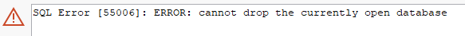
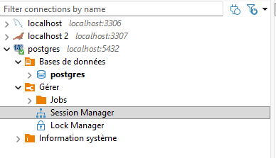
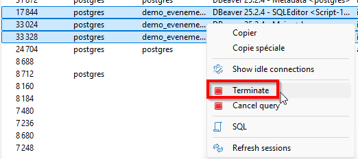

# 06 — Suppression simple (DROP)

## Objectif
Comprendre comment **supprimer une structure** (table ou base de données) à l’aide du DDL, et prendre conscience du **caractère irréversible** de ces opérations.

---

## Le rôle de DROP

L’instruction `DROP` permet de :
- supprimer définitivement une **table**
- supprimer définitivement une **base de données**

<div class="bg-yellow-50 border border-yellow-200 text-yellow-900 rounded-lg p-4">
<strong>À retenir</strong><br>
<code>DROP</code> agit sur la <strong>structure</strong> de la base de données, pas sur les données une par une.
</div>

---

## Supprimer une table

### Instruction DROP TABLE

```sql
drop table nom_table;
```

### Exemple

```sql
drop table inscription;
```

<div class="bg-red-50 border border-red-300 text-red-900 rounded-lg p-4">
<strong>Attention</strong><br>
La table est supprimée définitivement, ainsi que toutes les données qu’elle contient.
</div>

---

## Ordre de suppression des tables

Lorsqu’il y a des relations entre tables :

- une table contenant une **clé étrangère** dépend d’une autre table
- PostgreSQL empêche la suppression d’une table encore référencée

<div class="bg-yellow-50 border border-yellow-200 text-yellow-900 rounded-lg p-4">
<strong>Règle importante</strong><br>
Supprimer d’abord les tables dépendantes (avec clés étrangères), puis les tables référencées.
</div>

### Exemple d’ordre correct
1. inscription (contient des clés étrangères)
2. participant  
3. evenement  

---

## Supprimer une base de données

### Instruction DROP DATABASE

```sql
drop database nom_base;
```

### Exemple

```sql
drop database demo_evenements;
```

<div class="bg-red-50 border border-red-300 text-red-900 rounded-lg p-4">
<strong>Danger</strong><br>
La base de données complète est supprimée : tables, contraintes et données.<br>
Aucune récupération n’est possible dans le cadre du cours.
</div>

---

## Cas d’usage typiques dans le cours

- corriger une erreur de structure importante (voir la démo plus bas)
- nettoyer après des tests

<div class="bg-yellow-50 border border-yellow-200 text-yellow-900 rounded-lg p-4">
<strong>Bonnes pratiques</strong><br>

- Être certain de la base ou de la table ciblée avant d’exécuter un <code>DROP</code>.
- **Avoir une copie du code SQL ayant servi à créer la base de données ainsi que les tables.**

</div>

---

## Démo

Nous avons remarqué une erreur de structure dans une des tables de la démo précédente. Plus tard, nous verrons comme utiliser `ALTER` pour corriger cette erreur.
Pour le moment (et le premier TP), nous voulons un script de création complet et parfait. Nous allons donc supprimer les tables et la base de données pour ensuite réexécuter notre script corrigé.

### Étapes
- Supprimer la table `inscription`.
- Constater que les tables `participant` et `evenement` existent toujours.
- Observer la disparition de la relation dans la visualisation du schéma.
- Supprimer la bd
- Application de la correction dans la structure (ex.: un nouveau champ prénom dans participant)
- Réexécution du script complet.

## Astuce — Terminer les sessions actives avec le Session Manager (DBeaver)



Lorsque PostgreSQL refuse de supprimer une base de données parce qu’elle est encore utilisée, il est possible de fermer les connexions actives directement dans DBeaver.

### Étapes
- Se connecter à une autre base (ex. <code>postgres</code>).
- Dans l’arborescence, faire un clic droit sur la connexion PostgreSQL.
- Choisir <strong>Outils → Session Manager</strong>.
- Repérer les sessions associées à la base <code>demo_evenements</code>.
- Sélectionner les sessions actives.
- Cliquer sur <strong>Terminate</strong>.





<div class="bg-yellow-50 border border-yellow-200 text-yellow-900 rounded-lg p-4 mb-5">
PostgreSQL exige qu’aucune session ne soit connectée à une base avant de permettre sa suppression.
</div>
