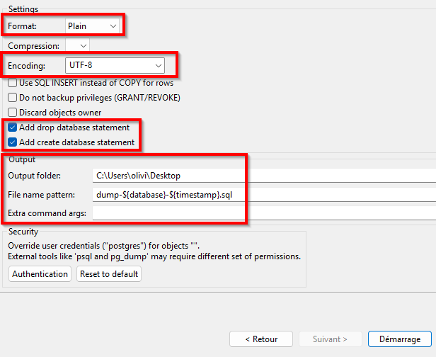

# 07 — Import et export d’une base de données

## Objectif
Savoir **exporter** et **importer une base de données complète** à l’aide de DBeaver afin de :
- sauvegarder un travail
- remettre un projet
- recréer une base de données existante

---

## Exporter une base de données (DBeaver)

Exporter une base de données permet de sauvegarder :
- la structure (tables, contraintes, clés)
- les données

### Étapes d'exportation
- Clic-droit sur la **base de données** dans DBeaver.
- Dans l'option `Outils`, choisir `Backup`
- Cocher le schéma `Public` ainsi que toutes les tables + `Suivant`
- Utiliser le format **Plain (SQL)** dans la liste déroulante.
- Choisir le `Encoding` en `UTF-8`
- Cocher `Add drop database statement` et `Add create database statement`
- Choisir et noter le `Output folder`
- Démarrage
- Ouvir et valider le fichier `.sql` généré.

<div class="bg-yellow-50 border border-yellow-200 text-yellow-900 rounded-lg p-4 mb-5">
<strong>À retenir</strong><br>
Le fichier exporté doit être un fichier <code>.sql</code> lisible.<br>
C'est normal de ne pas comprendre toutes les instructions qui y sont contenues.
</div>




---

## Importer une base de données (ligne de commande)

Le fichier SQL généré à l’étape d’export contient déjà :
- la suppression de la base de données (DROP DATABASE)
- la création de la base de données (CREATE DATABASE)
- la création des tables, contraintes et données

Il suffit donc **d’exécuter le fichier SQL au complet**.
Cela doit être fait en ligne de commande, car le script contient des instructions lisibles uniquement par le programme `psql`.

<div class="bg-yellow-50 border border-yellow-300 text-yellow-900 rounded-lg p-4">
<strong>Avez-vous ajouté psql à votre PATH?</strong><br>

[Ajouter psql au PATH](../../labs/lab01-installations.md#ajouter-au-path)
</div>

---

### Commande à utiliser

```bash
psql -U postgres -f chemin/vers/fichier.sql
```

### Exemple

```bash
psql -U postgres -f tp_evenements.sql
```

#### Signification des options utilisées avec psql

- <code>-U</code> : indique le **nom de l’utilisateur PostgreSQL** utilisé pour se connecter  
  (ex. <code>postgres</code>).
- <code>-f</code> : indique le **fichier SQL à exécuter**.

<div class="bg-red-50 border border-red-300 text-red-900 rounded-lg p-4 mb-5">
<strong>Attention</strong><br>
Le script supprime et recrée la base de données.<br>
S’assurer que le fichier SQL correspond bien au travail à importer.<br>
Encore une fois, toujours conserver une copie fonctionnelle des instructions que vous avez écrites pour votre travail.
</div>


---

## Démo

- Exporter une base de données avec DBeaver (format Plain).
- Repérer le fichier <code>.sql</code> généré.
- Exécuter le fichier avec <code>psql</code>.
- Vérifier que la base de données, les tables et les relations sont recréées.

<div class="bg-yellow-50 border border-yellow-200 text-yellow-900 rounded-lg p-4">
Si vous voulez être vraiment certain que ça fonctionne, supprimez manuellement votre base de données dans DBeaver avant l'exécution de la commande.
</div>

---

## À retenir

<div class="bg-yellow-50 border border-yellow-200 text-yellow-900 rounded-lg p-4">
<ul class="list-disc pl-5">
  <li>Exporter = sauvegarder une base de données</li>
  <li>Importer = recréer une base de données</li>
  <li>Le format utilisé est toujours <strong>Plain (SQL)</strong></li>
  <li>Tout se fait avec l’outil graphique DBeaver</li>
</ul>
</div>
