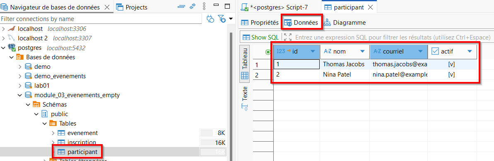

# 01 — Manipulation de données (insertion)

## Objectif
- Insérer des données dans une base de données
- Utiliser les valeurs par défaut
- Insérer plusieurs lignes
- Créer des données de test

---

## Base de données de test à importer

<div class="my-6 rounded-lg border border-yellow-300 bg-yellow-50 p-4 text-yellow-900">
<strong>Attention</strong><br>
Pour suivre les exemples de ce module, vous devez importer une <strong>base de données de test</strong>.

**Télécharger la base de données de test — Événements :** 
<br>
<a href="./../../databases/module_03_evenement_empty.sql" target="_blank" rel="noopener">Fichier .sql à télécharger</a>

</div>

Le fichier contient la structure des tables de la démonstration :
- `evenement`
- `participant`
- `inscription`

### Importation

Téléchargez le fichier SQL, puis exécutez dans un invite de commandes :<br>
**Changez le chemin d'accès du fichier selon où vous l'avez placé.**

```bash
psql -U postgres -f "C:\Users\Admin\Desktop\module_03_evenement_empty.sql"
```

---

## Utilité de INSERT

La commande **INSERT** permet d’ajouter des lignes dans une table d’une base de données.

Exemples d’utilisation :
- créer des données de test
- remplir une base de données
- simuler des scénarios réels

---

## Syntaxe de base

Insérer une ligne en **nommant les colonnes** :

```sql
insert into participant (nom, courriel, actif)  
values ('Thomas Jacobs', 'thomas.jacobs@example.com', true);

insert into participant (nom, courriel)  
values ('Nina Patel', 'nina.patel@example.com');
```

<div class="my-6 rounded-lg border border-blue-300 bg-blue-50 p-4 text-blue-900">

  - Les `valeurs` sont écrites dans l'ordre que les colonnes sont nommées.
  - Les valeurs par défaut ou autogénérées peuvent être omises (`id`, `actif`)

</div>

<div class="my-6 rounded-lg border border-blue-300 bg-blue-50 p-4 text-blue-900">
<strong>Voir les données</strong><br>
Pour le moment, pour voir les données, double-cliquez sur la table et allez dans l'onglet `données`



</div>


---

## Intégrité référentielle

Lorsqu'on référence avec une clée étrangère, une exception sera levée si la valeur n'existe pas dans la table référencée.

```sql
insert into inscription (evenement_id, participant_id, date_inscription)  
values (2, 1, '2026-03-17');
```

<div class="my-6 rounded-lg border border-yellow-300 bg-yellow-50 p-4 text-yellow-900">
<strong>Attention</strong><br>
Une exception pourrait levée. Pourquoi? Comment corriger?<br>
Ajoutons ensemble une nouvelle inscription fonctionnelle.

</div>

---

## Insertion de plusieurs lignes

```sql
insert into evenement (nom, date_evenement, lieu, capacite)
values
  ('Soirée jeux de société', '2026-03-15', 'Cafétéria', 80),
  ('Conférence cybersécurité', '2026-03-22', 'Amphi B', 150),
  ('Atelier introduction au SQL', '2026-03-29', 'Local C-101', 30);
```

---

## Données de test et IA

L’IA peut aider à générer des **données de test**, à condition de respecter :
- les contraintes d’unicité
- les clés étrangères
- les valeurs obligatoires
- respecter des contraintes venant du professeur / client

De plus :
- les données doivent être réalistes
- cette méthode est réservée **uniquement au développement**

---

### Principe général

La génération des données se fait en **deux étapes** :

1. Générer les données pour les tables **sans clés étrangères**
2. Générer ensuite les données pour les tables **avec clés étrangères**, en se basant sur les clés primaires réellement créées par PostgreSQL

---

<div class="my-6 rounded-lg border border-yellow-300 bg-yellow-50 p-4 text-yellow-900">
<strong>Important</strong><br>
Il est impossible de savoir à l’avance quelles valeurs de clés primaires seront générées par PostgreSQL.<br>
Elles ne sont <strong>pas nécessairement</strong> 1, 2, 3, 4, 5, etc.<br><br>
Les requêtes INSERT qui utilisent des clés étrangères doivent donc être générées <strong>après</strong> l’insertion des premières données.
</div>

---

### Exemple de requêtes à envoyer à l’IA

#### Première requête — tables sans clés étrangères

Copiez le  [**script de création des tables**](./../02-ddl-base/05-demo-ddl.md#demo-ddl-code)  
(ou un export SQL de votre base de données), puis envoyez la requête suivante à l’IA :

```text
À partir du script de création des tables fourni, génère des INSERT SQL pour PostgreSQL
uniquement pour les tables sans clés étrangères.

Contraintes :
- respecter toutes les contraintes définies (NOT NULL, UNIQUE, CHECK, DEFAULT)
- générer des données réalistes
- ne pas inclure de CREATE TABLE
- retourner uniquement le SQL prêt à être exécuté
```

<details>
<summary>Exemple de réponse</summary>

```sql
INSERT INTO evenement (nom, date_evenement, lieu, capacite, actif) VALUES
('Conférence Tech 2026', '2026-03-15', 'Paris', 300, true),
('Atelier Data Science', '2026-04-02', 'Lyon', 40, true),
('Salon de l''Entrepreneuriat', '2026-05-20', 'Marseille', 500, true),
('Meetup Développement Web', '2026-02-10', 'Toulouse', 80, true),
('Formation Cybersécurité', '2026-06-05', 'Lille', 25, false);

INSERT INTO participant (nom, courriel, actif) VALUES
('Alice Martin', 'alice.martin@example.com', true),
('Bruno Lefèvre', 'bruno.lefevre@example.com', true),
('Camille Dupont', 'camille.dupont@example.com', true),
('David Moreau', 'david.moreau@example.com', true),
('Emma Girard', 'emma.girard@example.com', false),
('François Bernard', 'francois.bernard@example.com', true),
('Julie Petit', 'julie.petit@example.com', true);
```

</details>

#### Deuxième requête — tables avec clés étrangères

Une fois les premières données insérées, envoyez une seconde requête :

```text
Voici les clées primaires générées pour les tables événement et participant dans ma base de données PostgreSQL.
À partir des clés primaires réellement générées, génère des INSERT SQL
pour les tables contenant des clés étrangères.

Contraintes :
- utiliser uniquement des clés primaires existantes
- respecter toutes les contraintes (FK, UNIQUE, NOT NULL)
- ne pas générer de doublons
- retourner uniquement le SQL prêt à être exécuté
```

<details>
<summary>Exemple de réponse</summary>

```sql
INSERT INTO inscription (evenement_id, participant_id, date_inscription) VALUES
(1, 1, '2026-01-10'),
(1, 2, '2026-01-12'),
(1, 3, '2026-01-15'),

(2, 2, '2026-02-01'),
(2, 4, '2026-02-02'),

(3, 1, '2026-03-05'),
(3, 5, '2026-03-06'),
(3, 6, '2026-03-07'),

(4, 3, '2026-01-25'),
(4, 4, '2026-01-26'),
(4, 7, '2026-01-27'),

(5, 2, '2026-04-01'),
(5, 6, '2026-04-02');
```

</details>

#### Bon réflexe

Commencer par un petit jeu de données

Insérer les données table par table

Valider avec des requêtes SELECT

Ajuster les requêtes IA au besoin

<div class="my-6 rounded-lg border border-yellow-300 bg-yellow-50 p-4 text-yellow-900"> <strong>Attention</strong><br> 
Exécutez uniquement du code que vous comprenez et que nous avons vu en classe.<br>
</div>

