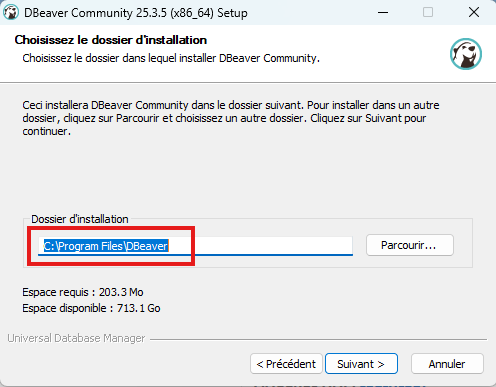
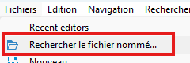

# Révision — Examen 1

## Consignes

### Contexte
- L'examen sera réalisé à l'aide du logiciel Safe Exam Browser. Vous devez l'avoir installé au préalable.
- Vos réponses seront inscrites dans un fichier .sql disponible  5 minutes avant l'heure de début de l'examen.
- Le fichier .sql devra être remis au plus tard 2h50 après le début de l'examen.
- 10% de pénalité sera appliqué par minute de retard.

### Modalités
-	Durée : 2h50
-	Aucune sortie tolérée
-	Permis : site du cours uniquement
-	Aucune aide extérieure n'est permise (autres sites Web, Ami, IA, etc.).
-	Assurez-vous d'écrire des réponses complètes et détaillées.
-	Veuillez remettre votre fichier .sql sur Léa dans le travail nommé Examen 1.

<div class="my-6 rounded-lg border border-yellow-300 bg-yellow-50 p-4 text-yellow-900">
  <strong>Important — Installation de Safe Exam Browser :</strong><br>
  Vous devez <strong>obligatoirement</strong> installer et tester
  <a href="https://safeexambrowser.org/download_en.html" class="underline text-blue-600" target="_blank">Safe Exam Browser</a>
  avant la journée de l'examen. Vérifiez réaliser la simulation dans les plus brefs délais.
</div>

<div class="my-6 rounded-lg border border-red-300 bg-red-50 p-4 text-red-900">
  <strong>Important — Installation de DBeaver :</strong><br>
  Vous devez <strong>obligatoirement</strong> vérifier si DBeaver est installé dans Program Files (Fichiers de programme)<br>
  Si ce n'est pas le cas :

  - Option 1: Déplacer le répertoire de DBeaver de AppData à Program Files
  - Option 2: Réinstaller DBeaver en réexécutant l'assistant d'installation et en choisissant Program Files comme emplacement d'installation.
  <a href="https://dbeaver.io/download/" class="underline text-blue-600" target="_blank">Lien vers l'assistant DBeaver</a>
  
</div>

## Contenu de l'examen

- **Examen** : EXAMEN 1 — Bases de données relationnelles (SQL)
- **Durée** : 2h50 — pas de sortie autorisée; aide externe interdite; remettre un fichier `.sql`.
- **Contexte** : le domaine peut varier selon votre groupe (réservations, ventes, inventaires, etc.). Les exercices portent sur la modélisation, l'intégrité référentielle, DDL/DML et requêtes SELECT.
- **Organisation** :
  - **Partie 1 — Lecture & modèle (40 pts)** : compléter PK/FK et inserts, analyser cardinalités, proposer contraintes/types, interpréter des requêtes.
  - **Partie 2 — DDL/DML (33 pts)** : créer/modifier des tables, rédiger DROP/INSERT/UPDATE/DELETE (incluant sous-requêtes et contraintes).
  - **Partie 3 — SELECT (27 pts)** : filtrage, recherche textuelle, DISTINCT/ORDER BY, sous‑requêtes (corrélées/non corrélées).
- **Remarque** : tester les requêtes sur une base de test avant de sauvegarder votre fichier de réponse; respecter les noms de tables/colonnes si l'énoncé l'exige.


## Simulation d'examen

- Assurez-vous d'avoir téléchargé et **dézippé** le fichier de révision dans le travail nommé `E1-Révision` sur Léa.
- Prenez en note l'endroit où le fichier a été téléchargé (ex.: `Téléchargements`)
- Exécutez le fichier `revision-examen1.seb`
- Entrez le mot de passe 1234
- Vous aurez accès à DBeaver et au site du cours uniquement
- Dans DBeaver, vous pouvez ouvrir le fichier .sql (voir image)
- Sauvegarder votre fichier de réponse fréquemment




### Contexte

Une plateforme de diffusion culturelle permet à des clients d’acheter des billets pour assister à différents spectacles.

Chaque client possède un compte personnel contenant ses informations de contact et peut enregistrer une ou plusieurs cartes de crédit pour effectuer ses paiements.

Les spectacles sont offerts à des dates précises et comportent un prix fixe.

Lorsqu’un client achète un billet, une transaction est enregistrée afin d’associer ce client au spectacle choisi.

---

###  PARTIE 1 — Lecture et compréhension du modèle

#### 1. Comprendre les relations

Répondez aux questions suivantes :

1. Quel est le type de relation entre `client` et `billet` ?
2. Quel est le type de relation entre `spectacle` et `billet` ?
3. Quel est le type de relation entre `client` et `carte_credit` ?

Justifiez en proposant des exemples textuels des relations (ex.: un `entité` peut avoir plusieurs `autre entité` et vice versa).

---

#### 2. Identifier les clés

1) Complétez le modèle de données suivant :
   - ajouter les clés primaires
   - ajouter les clés étrangères
   - ajouter les références vers les bonnes table (`foregin key ... references ...`) dans la table billet
   - ajoutez des contraintes où cela est pertinent
   - modifiez les types de données mal choisis
   - complétez la table carte de crédit

2) Testez votre code sur une nouvelle base de données.
   
3) Enregistrez votre code fonctionnel dans un fichier nommé `nom_prenom_revision.sql`.

```sql
create table client (
  -- Ajouter une clé primaire
  nom varchar(80),
  courriel varchar(120),
  telephone numeric(12,0),
  est_actif boolean
);

create table spectacle (
  -- Ajouter une clé primaire
  titre varchar(100),
  date_spectacle date,
  prix integer,
  est_actif boolean
);

create table billet (
  -- Ajouter une clé primaire
  date_achat time,
  client_id integer,
  est_actif boolean,
  -- Ajouter les clés étrangères
  -- Ajouter les références vers les tables référencées
);

create table carte_credit (
  -- Complétez cette table en ajoutant:
  -- Clée primaire, numero, date d'expiration, csv, référence vers la table client
);

insert into client (...) values
  (1, ...),
  (2, ...),
  (3, ...),
  (4, ...),
  (5, ...);

insert into spectacle (...) values
  (1, ...),
  (2, ...),
  (3, ...),
  (4, ...),
  (5, ...);

insert into billet (...) values
  (1, ...),
  (2, ...),
  (3, ...),
  (4, ...),
  (5, ...);

insert into carte_credit (...) values
  (1, ...),
  (2, ...),
  (3, ...),
  (4, ...),
  (5, ...);

```
> Note: Les insertions seront partiellement complétées pour vous la journée de l'examen.

### PARTIE 2 — Manipulation de données
#### 5. INSERT
Rédigez les requêtes d’insertion nécessaires afin de :
- Ajouter 5 clients avec des informations réalistes.
- Ajouter 5 spectacles (dates variées, prix plausibles).
- Ajouter 5 billets, en respectant les relations entre :
  - client et spectacle
- Ajouter 2 cartes de crédit associées à des clients existants.

Contraintes
- Les clés étrangères doivent référencer des enregistrements existants.
- Les valeurs doivent être cohérentes et réalistes.
- Les identifiants peuvent être fournis explicitement pour simplifier la correction.
- Les données doivent s’exécuter sans erreur.

#### 6. UPDATE
Désactivez tous les spectacles qui répondent à une combinaison de critères choisis par vous en utilisant AND et BETWEEN.

#### 7. DELETE
Supprimez les clients inactifs qui n'ont jamais acheté de billet.

La solution doit utiliser une sous-requête.

### PARTIE 3 — SELECT
#### 8. Filtrage simple
Afficher les spectacles qui :
  - sont actifs
  - coûtent entre 50$ et 100$

#### 9. Recherche textuelle
Afficher les spectacles dont :
  - le titre ne contient pas un mot choisi par vous selon vos données.

#### 10. DISTINCT + ORDER BY
  - Afficher la liste distincte des dates de spectacle, triées en ordre décroissant.

#### 11. Sous-requête non corrélée
  - Afficher les clients (nom + courriel) qui ont acheté au moins un billet pour un spectacle coûtant plus de 75 $.

### Sortie de Safe Exam Browser
- Assurez-vous d'avoir bien sauvegardé votre fichier d'examen
- Quittez Safe Exam Browser et entrez le mot de passe 4321
- Remettez votre révision dans le travail associé sur Léa