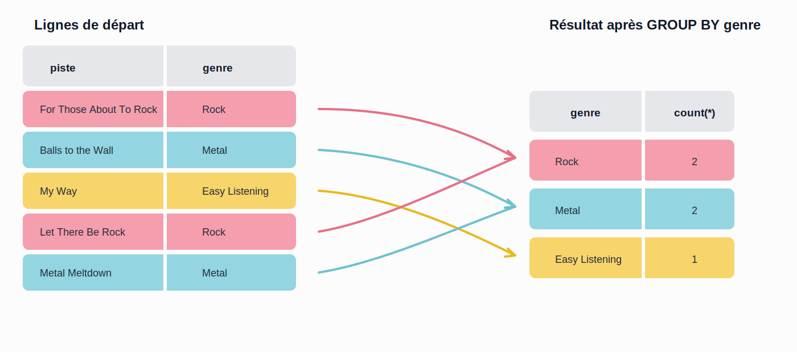

---
title: "04 — Group By et Having"
---

# 04 — Group By et Having

## Objectif

Comprendre comment :
- regrouper des lignes avec `group by`
- appliquer une fonction d'agrégation sur chaque groupe
- filtrer des groupes avec `having`
- distinguer clairement `where` et `having`

---

## `Group by`

Sans `group by`, une fonction d'agrégation retourne une seule ligne pour l'ensemble des données.

Exemple :

```sql
select avg(total) montant_moyen
from facture;
```

Cette requête donne une seule moyenne pour **toutes** les factures.

Avec `group by`, on peut plutôt demander une moyenne, un total ou un nombre **par catégorie** :
- par pays
- par client
- par genre
- par facture

Exemple d'idée :
- combien y a-t-il de clients par pays ?
- quel est le total des ventes par client ?
- combien de pistes y a-t-il par genre ?

Vue visuelle du principe avec Chinook : plusieurs pistes appartiennent au même genre, puis `group by genre` regroupe ces lignes et `count(*)` calcule le nombre de pistes dans chaque groupe.



Exemple SQL correspondant :

```sql
select g.nom genre, count(*) nombre_pistes
from genre g
join piste p
	on g.genre_id = p.genre_id
group by g.nom
order by g.nom;
```

<div class="my-3 rounded-lg border border-red-300 bg-red-50 p-3 text-red-900">
<strong>Important</strong><br>
On utilise <code>group by</code> presque toujours avec une fonction d'agrégation. Si vous faites un <code>group by</code>, vous êtes généralement en train de résumer des données.
</div>

---

### Syntaxe générale

```sql
select colonne_groupe, fonction_agregation(colonne)
from table
where condition
group by colonne_groupe
order by colonne_groupe;
```
> `colonne_groupe` ici indique la colonne sur laqelle le `group by` sera appliqué

À retenir :
- les colonnes dans le `select` qui ne sont pas agrégées doivent être dans le `group by`
- `where` filtre les lignes **avant** le regroupement
- `group by` forme les groupes
- la fonction d'agrégation calcule une valeur pour chaque groupe
- `order by` trie le résultat final

---

### Premier exemple simple

### Exemple — Combien y a-t-il de clients par pays ?

```sql
select pays, count(*) nombre_clients
from client
group by pays
order by pays;
```

Ici :
- `group by pays` forme un groupe pour chaque pays
- `count(*)` compte le nombre de lignes dans chaque groupe

---

### Deuxième exemple simple

### Exemple — Quel est le total facturé par client ?

On regroupe ici les factures selon `client_id`.

```sql
select client_id, sum(total) montant_total
from facture
group by client_id
order by client_id;
```

Cette requête produit une ligne par client qui a au moins une facture.

---

### Exemple avec jointure

Très souvent, on combine `group by` avec des jointures pour afficher un résultat qui concerne plus d'une table.

### Exemple — Afficher le nombre d'albums par artiste

```sql
select ar.nom artiste, count(*) nombre_albums
from artiste ar
join album al
	on ar.artiste_id = al.artiste_id
group by ar.nom
order by nombre_albums desc, ar.nom;
```

Pourquoi grouper par `ar.nom` ?
- `count(*)` calcule le nombre d'albums dans chaque groupe
- `ar.nom` est affiché dans le `select`, donc il doit faire partie du regroupement

---

### `where` avant `group by`

`where` sert à filtrer les lignes **avant** que les groupes soient formés.

### Exemple — Nombre de clients par pays, mais seulement au Canada et aux États-Unis

```sql
select pays, count(*) nombre_clients
from client
where pays in ('Canada', 'USA')
group by pays
order by pays;
```

Le filtre `where` retire d'abord les autres pays, puis `group by` regroupe seulement les lignes restantes.

---

## `Having`

Quand une requête contient un `group by`, on veut parfois filtrer **les groupes eux-mêmes**.

Exemple :
- garder uniquement les pays qui ont plus de 5 clients
- garder uniquement les artistes qui ont au moins 3 albums
- garder uniquement les clients dont le total des achats dépasse 40

Dans ce cas, `where` ne convient pas, car `where` agit avant l'agrégation.
Il faut utiliser `having`, qui agit **après** le regroupement.

<div class="my-3 rounded-lg border border-red-300 bg-red-50 p-3 text-red-900">
<strong>Important</strong><br>
Avec une requête qui utilise <code>group by</code>, on remplace le réflexe <code>where</code> par <code>having</code> dès qu'on veut filtrer sur un résultat agrégé comme <code>count(*)</code>, <code>sum(total)</code> ou <code>avg(...)</code>.
</div>

---

### Syntaxe générale avec `having`

```sql
select colonne_groupe, fonction_agregation(colonne)
from table
where condition
group by colonne_groupe
having condition_sur_agregation
order by colonne_groupe;
```

Résumé :
- `where` filtre les lignes
- `having` filtre les groupes

---

### Exemple avec `having`

### Exemple — Afficher les pays qui ont plus de 5 clients

```sql
select pays, count(*) nombre_clients
from client
group by pays
having count(*) > 5
order by nombre_clients desc, pays;
```

Ici :
- `group by pays` crée un groupe par pays
- `count(*)` calcule le nombre de clients dans chaque pays
- `having count(*) > 5` conserve seulement les groupes qui respectent cette condition

---

### Exemple avec jointure et `having`

### Exemple — Afficher les clients dont le total des achats dépasse 40

```sql
select
	c.client_id,
	c.prenom,
	c.nom_famille,
	sum(f.total) montant_total
from client c
join facture f
	on c.client_id = f.client_id
group by c.client_id, c.prenom, c.nom_famille
having sum(f.total) > 40
order by montant_total desc, c.nom_famille, c.prenom;
```

Cette requête :
- joint les clients à leurs factures
- additionne les montants par client
- ne conserve que les clients dont le total dépasse 40

---

### Exemple supplémentaire avec le catalogue musical

### Exemple — Afficher les genres qui contiennent au moins 10 pistes

```sql
select g.nom genre, count(*) nombre_pistes
from genre g
join piste p
	on g.genre_id = p.genre_id
group by g.genre_id, g.nom
having count(*) >= 10
order by nombre_pistes desc, g.nom;
```

---

### `where` ou `having` ?

Utilisez `where` si la condition porte sur une ligne individuelle :

```sql
select client_id, sum(total) montant_total
from facture
where total >= 5
group by client_id;
```

Ici, on exclut d'abord les factures de moins de 5.

Utilisez `having` si la condition porte sur le résultat agrégé :

```sql
select client_id, sum(total) montant_total
from facture
group by client_id
having sum(total) >= 40;
```

Ici, on garde les clients dont la somme des factures atteint au moins 40.

---

## À retenir

- `group by` sert à regrouper les lignes
- une fonction d'agrégation calcule une valeur pour chaque groupe
- `where` filtre avant le regroupement
- `having` filtre après le regroupement
- si une colonne apparaît dans le `select` sans fonction d'agrégation, elle doit être dans le `group by`

---

<div class="my-6 rounded-lg border border-blue-300 bg-blue-50 p-4 text-blue-900">
	<strong class="block">ℹ️ À faire maintenant</strong>
	<p class="m-0">
		Pour mettre ces notions en pratique, passez à la
		<a href="./../../labs/lab07-agregations#partie-1" class="font-semibold underline hover:text-blue-700">
			partie 1 du laboratoire 7 — Agrégations, <code>group by</code> et <code>having</code>
		</a>.
	</p>
</div>
