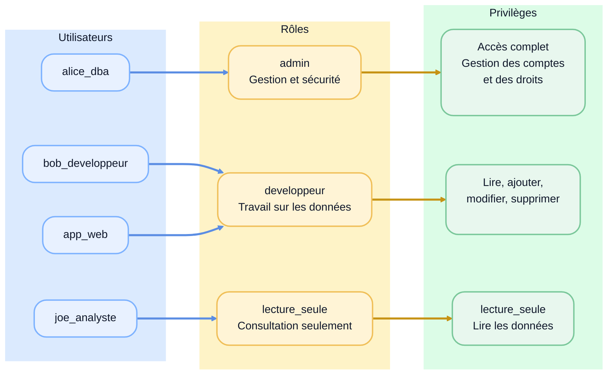

# 04 — Gestion de comptes et privilèges

## Objectif
Comprendre la différence entre **utilisateur**, **rôle** et **privilège** dans PostgreSQL, savoir attribuer des droits adaptés au contexte, puis vérifier que ces droits sont bien en place.

## L'essentiel à connaître

Dans PostgreSQL, on ne donne pas tous les droits à tout le monde.

Le bon réflexe est :
- donner seulement les droits nécessaires
- séparer les responsabilités
- éviter d'utiliser un compte trop puissant pour une application

## Structurer les accès

### Le modèle à retenir

Pour ne pas mêler les concepts, retenez ce modèle simple :

1. un **utilisateur** est une identité de connexion
2. un **rôle** sert souvent à regrouper des permissions
3. un **privilège** est un droit précis sur un objet précis

En pratique PostgreSQL unifie tout cela sous le mot **rôle**.
Donc :
- un utilisateur = un rôle qui peut se connecter
- un rôle de groupe = un rôle sans connexion, utilisé pour porter des droits

Le bon réflexe est donc :
- créer des utilisateurs pour les personnes et les applications
- créer des rôles pour représenter des fonctions comme `admin`, `developpeur`, `lecture_seule`
- attribuer les privilèges aux rôles
- ajouter ensuite les utilisateurs aux rôles



> On rattache des utilisateurs à des rôles, puis on accorde les privilèges aux rôles.

---

### Utilisateur, rôle, privilège

### Utilisateur

Un utilisateur est un compte qui peut se connecter à PostgreSQL.

En pratique, dans PostgreSQL :
- un utilisateur est un **rôle avec l'attribut `login`**
- `create user` est essentiellement une forme pratique de `create role ... login`

```sql
create user bob with password 'mot_de_passe_dev';
```

### Rôle

- Un rôle va normalement servir à porter des privilèges (lecture, écriture, etc.).
- On va ensuite attribuer un à plusieurs rôles à un utilisateur

```sql
create role admin;
create role developpeur;
create role lecture_seule;

grant admin to alice;
grant developpeur to bob;
grant lecture_seule to joe_analyste;
```

### Privilège

Un privilège est un droit d'effectuer une action sur un objet PostgreSQL.

Exemples :
- `connect` sur une base de données
- `usage` sur un schéma
- `select`, `insert`, `update`, `delete` sur une table
- `execute` sur une fonction

---

### Qui devrait avoir quels droits

Il n'existe pas une seule réponse parfaite, mais certains profils reviennent souvent.

### Administrateur

Un administrateur peut typiquement :
- créer des rôles et des comptes
- accorder ou révoquer des privilèges
- gérer la structure
- intervenir sur la sécurité et la maintenance

On évite cependant d'utiliser ce compte pour les tâches normales de l'application.

### Développeur

Selon le contexte, un développeur peut :
- lire les données
- insérer, modifier ou supprimer certaines données
- parfois créer ou modifier des objets dans un environnement de développement

Mais il ne devrait pas automatiquement avoir tous les droits partout, surtout en production.

### Analyste ou lecteur

Un analyste ou un lecteur a souvent seulement besoin de :
- `connect` à la base de données
- `usage` sur le schéma
- `select` sur une à plusieurs tables

### Compte applicatif

Le compte utilisé par une application mérite une attention particulière.

Bonne pratique :
- lui donner uniquement les droits requis par l'application
- éviter `all privileges`
- éviter de lui permettre de modifier la structure
- éviter d'utiliser un compte administrateur dans la chaîne applicative

Exemple :
- une application de consultation peut n'avoir besoin que de `select`
- une application transactionnelle peut avoir besoin de `select`, `insert`, `update`, parfois `delete`

En cas d'injection SQL, ce compte ne pourra alors faire que ce qui lui est permis.

---

### Une manière simple d'organiser les accès

Une structure simple et claire ressemble souvent à ceci :

#### Utilisateurs

- `alice` : utilisateur réel
- `bob` : utilisateur réel
- `joe_analyste` : utilisateur réel
- `app_web` : utilisateur applicatif

#### Rôles

- `admin` : rôle de gestion de la base de données
- `developpeur` : rôle de travail sur les données
- `lecture_seule` : rôle de consultation

Puis :
- on donne les privilèges aux rôles
- on rattache les utilisateurs aux rôles

Exemple :

```sql
create user alice_admin with password 'mot_de_passe_admin';
create user bob_dev with password 'mot_de_passe_dev';
create user joe_analyste with password 'mot_de_passe_lecture';
create user app_web with password 'mot_de_passe_app';

create role admin;
create role developpeur;
create role lecture_seule;

grant admin to alice_admin;
grant developpeur to bob_dev;
grant lecture_seule to joe_analyste;
grant developpeur to app_web; -- Tâches semblables au développeur
```

Cette approche est plus facile à maintenir que de gérer chaque utilisateur séparément.

## Gérer les privilèges avec `grant`

### Donner l'accès à la base de données

```sql
grant connect on database nom_de_la_bd to developpeur;
grant connect on database nom_de_la_bd to lecture_seule;
```

### Donner l'accès au schéma

Dans PostgreSQL, beaucoup d'exemples utilisent le schéma `public`.

```sql
grant usage on schema public to developpeur;
grant usage on schema public to lecture_seule;
```

### Donner des droits sur les tables

```sql
grant select, insert, update, delete
on all tables in schema public
to developpeur;

grant select
on all tables in schema public
to lecture_seule;
```

### Donner des droits sur les séquences (`serial`)

Quand des colonnes auto-générées (clés primaires) utilisent des séquences (pensez au type `serial`), il faut aussi donner des droits sur ces séquences.

```sql
grant usage, select
on all sequences in schema public
to developpeur;
```

### Donner des droits à un administrateur

Le rôle `admin` peut recevoir des droits plus larges sur la base de données.

```sql
grant connect, create on database nom_de_la_bd to admin;
grant usage, create on schema public to admin;
grant all privileges on all tables in schema public to admin;
grant all privileges on all sequences in schema public to admin;
```

- `admin` n'est pas automatiquement un superutilisateur PostgreSQL
- ces `grant` donnent beaucoup de pouvoir sur les objets visés

---

### Retirer des droits avec `revoke`

`revoke` sert à retirer un privilège ou un rôle.

```sql
revoke update on table employe from developpeur;

revoke developpeur from bob;

revoke all on table employe from lecture_seule;
```

Le principe reste le même :
- `grant` accorde
- `revoke` retire

---

### Quelques privilèges à connaître

Le tableau suivant résume les privilèges les plus utiles à retenir dans ce cours.
L'idée n'est pas de tout mémoriser, mais de reconnaître les plus fréquents.

| Privilège | S'applique surtout à | Permet essentiellement de |
|---|---|---|
| `CONNECT` | base de données | se connecter à une base de données |
| `USAGE` | schéma, séquence, type | accéder à un schéma ou utiliser certains objets |
| `CREATE` | base de données, schéma, tablespace | créer de nouveaux objets |
| `SELECT` | table, vue, séquence | lire des données |
| `INSERT` | table | ajouter des lignes |
| `UPDATE` | table | modifier des lignes |
| `DELETE` | table | supprimer des lignes |
| `REFERENCES` | table, colonne | créer une clé étrangère qui référence la table |

Source :
- [PostgreSQL Documentation — Privileges](https://www.postgresql.org/docs/current/ddl-priv.html)

## Valider les droits dans PostgreSQL

Voici quelques requêtes SQL simples que vous pouvez exécuter directement dans DBeaver.

### Voir les rôles

Les rôles commençant par pg on été intentionnellement retirés.

```sql
select rolname, rolcanlogin, rolsuper, rolcreatedb, rolcreaterole
from pg_roles
where rolname not like 'pg%'
order by rolname;
```

### Voir quel utilisateur est actif

```sql
select current_user, session_user;
```

Repère :
- `session_user` correspond au compte de départ
- `current_user` correspond au rôle actif au moment présent

Si vous utilisez `set role`, `current_user` peut changer alors que `session_user` reste identique.

### Voir les bases de données

```sql
select datname
from pg_database
order by datname;
```

### Voir les privilèges sur les tables

```sql
select grantee, table_schema, table_name, privilege_type
from information_schema.role_table_grants
where table_schema = 'public'
order by grantee, table_name, privilege_type;
```

### Voir les privilèges sur une table précise

```sql
select grantee, table_schema, table_name, privilege_type
from information_schema.role_table_grants
where table_schema = 'public'
  and table_name = 'client'
order by grantee, privilege_type;
```

### Voir les privilèges sur les séquences

```sql
select grantee, object_schema, object_name, privilege_type
from information_schema.usage_privileges
where object_schema = 'public'
order by grantee, object_name, privilege_type;
```

### Tester avec un rôle précis

On peut aussi valider le comportement en se connectant avec un autre utilisateur, ou en testant avec :

```sql
select current_user, session_user;

set role developpeur;
select current_user, session_user;
select * from employe;
reset role;
```

Cette approche permet de vérifier concrètement ce qu'un rôle peut ou ne peut pas faire.

## À retenir

- dans PostgreSQL, tout tourne autour de la notion de rôle
- un utilisateur est essentiellement un rôle avec droit de connexion
- le plus simple est de donner les privilèges à des rôles de groupe, puis d'y rattacher les utilisateurs
- il faut attribuer les droits selon le principe du moindre privilège
- les comptes applicatifs ne devraient pas avoir plus de droits que nécessaire
- `grant` accorde, `revoke` retire, et on peut vérifier le résultat avec SQL ou avec l'interface de DBeaver

---

### Sources

- [PostgreSQL Documentation — Privileges](https://www.postgresql.org/docs/current/ddl-priv.html)
- [PostgreSQL Documentation — GRANT](https://www.postgresql.org/docs/current/sql-grant.html)
- [PostgreSQL Documentation — REVOKE](https://www.postgresql.org/docs/current/sql-revoke.html)
---

<div class="my-6 rounded-lg border border-blue-300 bg-blue-50 p-4 text-blue-900">
	<strong class="block">ℹ️ À faire maintenant</strong>
	<p class="m-0">
		Passez au
		<a href="./../../labs/lab09-securite" class="font-semibold underline hover:text-blue-700">
			laboratoire 9 — Sécurité, comptes et privilèges
		</a>
		pour mettre en pratique la création de comptes, de rôles et l'attribution de privilèges dans Chinook.
	</p>
</div>
